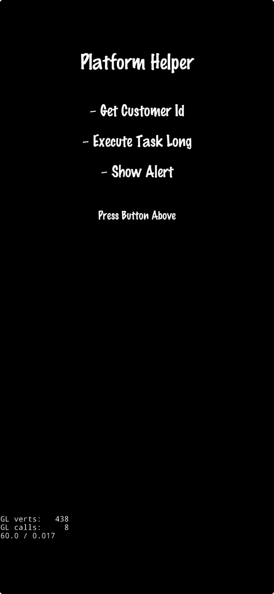

# Axmol Platform Helper

This is a project that add the ability to call specific `Platform Functions`.

Web demo: https://axnh.netlify.app/

## Files To Add

These are the new files that you need:

- /Platform
- /proj.android/app/src/org/axmol/platform/PlatformDelegate.java
- /proj.android/app/src/org/axmol/app/MainApplication.java

## Code Changes

There are some small changes that you need do to your project to include this.

### CMake root file: CMakeLists.txt

1 - Add platform directory:

```cmake
add_subdirectory(Platform)
```

2 - Add emscripten code for embind:

```cmake
if (WASM)
    target_link_libraries(${APP_NAME} "embind")
    set_target_properties(${APP_NAME} PROPERTIES LINK_FLAGS "--bind")
endif()
```

### Project delegate file: AppDelegate.cpp

1 - Include config file:

```cpp
#include "common/PlatformHelperConfig.hpp"
```

### Android project changes

You need this if you will use application/activity context for some UI library or SDK.

1 - **proj.android/app/AndroidManifest.xml:**

```xml
<application android:name="org.axmol.app.MainApplication"
[...]
```

2 - **proj.android/app/build.gradle:**

```groovy
implementation 'androidx.annotation:annotation:1.8.0'
```

## Screenshot


